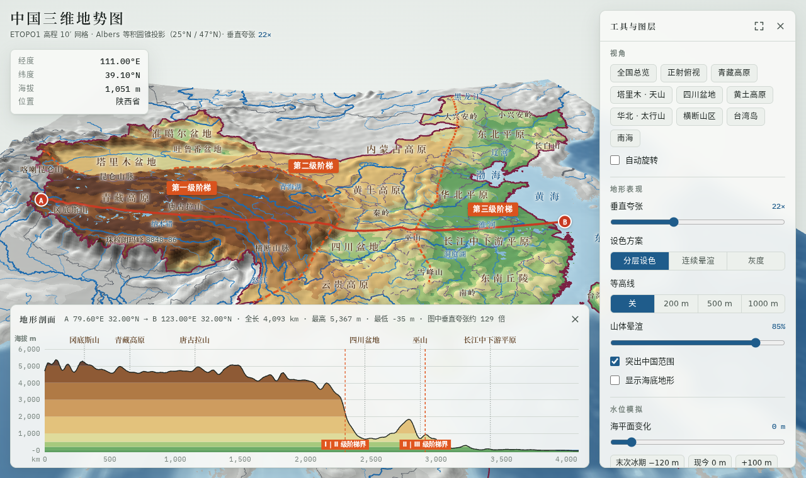

# 中国三维地势图

可交互的中国三维地形网页，面向中学、大学地理课堂与教学研究。基于真实高程数据，在浏览器中直接打开，无需安装。

**在线访问：<https://fuzzylogic112.github.io/china-terrain-3d/>**



## 功能

- **三维地形**：鼠标左键拖动旋转，右键拖动平移，滚轮缩放；手机和平板上用手指操作。垂直夸张 1–60 倍可调。
- **设色与等高线**：分层设色、连续晕渲、灰度三种方案；200 / 500 / 1000 m 等高线；山体晕渲强度可调。
- **图层**：国界与省级界线、河流湖泊、地形区、山脉与山峰、海洋、省级行政中心、三级阶梯分界线、秦岭—淮河线、胡焕庸线。
- **地名卡片**：点击地形区、山脉、山峰名称，弹出教材式简介，并自动飞到该处。
- **地形剖面**：在地图上任选两点生成剖面图，自动标出沿线地形区和阶梯分界。内置 32°N、40°N、88°E、105°E 四条经典剖面。
- **水位模拟**：海平面 −120 m（末次冰期）到 +3000 m。只淹没与海洋连通的低地，封闭盆地不会“倒灌”。
- **实时读数**：悬停显示经纬度、海拔和所在省级行政区。
- **课堂投影**：一键全屏；十个预设视角（全国总览、青藏高原、四川盆地、黄土高原、横断山区等）。

## 离线使用

所有资源（three.js、字体、数据）都在仓库里，不依赖外部 CDN。

1. 点击本页绿色 **Code → Download ZIP**，解压。
2. 双击 `index.html`，用 Chrome、Edge 或 Firefox 打开即可，不需要联网。

离线双击打开时，浏览器可能不加载网页字体，会改用系统字体显示，功能不受影响。

## 数据来源与说明

| 内容 | 来源 | 许可 |
| --- | --- | --- |
| 高程（含海底） | NOAA ETOPO1，经 [Fatiando a Terra](https://github.com/fatiando-data/earth-topography-10arcmin) 重采样为 10′ 网格 | 原始数据公有领域；重采样网格 CC BY 4.0 |
| 省级行政区 | [Apache ECharts](https://github.com/apache/echarts) 4.9 内置中国地图 | Apache-2.0 |
| 河流、湖泊、邻国界线、南海断续线 | [Natural Earth](https://www.naturalearthdata.com/) 1:10m | 公有领域 |
| 三级阶梯分界线、秦岭—淮河线 | 按教材示意手绘 | — |

- 10′ 网格约 18 km，尖峰会被平滑：图中珠峰一带约 6000 m。读数宜理解为区域平均高度，适合讲解大地形格局。
- 地图采用 Albers 等积圆锥投影（标准纬线 25°N、47°N，中央经线 105°E）。
- **边界仅为教学示意。公开出版、印刷地图请使用[自然资源部标准地图服务](http://bzdt.ch.mnr.gov.cn/)。**

## 开发

网站由 GitHub Pages 从 `gh-pages` 分支发布。推送到 `main` 后，Actions 会自动把 `main` 同步到 `gh-pages`，约 1 分钟后线上更新。

```bash
npm install          # 安装 esbuild 与 three.js
npm run build        # src/main.js → assets/app.js
npm run serve        # http://localhost:8000 本地预览

pip install numpy netCDF4 shapely pillow
npm run data         # 下载原始数据并重新生成 assets/geo-data.js
```

目录结构：

```
index.html              页面与样式
src/main.js             主程序（three.js 渲染、剖面、水位模拟、标注）
assets/app.js           打包后的程序
assets/geo-data.js      高程网格、行政区掩膜、河流与界线
assets/fonts/           衬线字体子集（Noto Serif SC）与 IBM Plex Mono
tools/build_data.py     数据处理脚本
tools/subset_fonts.py   字体子集化脚本（修改地名后需重新运行）
```

## 许可

代码以 MIT 许可发布。字体 Noto Serif CJK 与 IBM Plex Mono 采用 SIL Open Font License 1.1；数据许可见上表。
